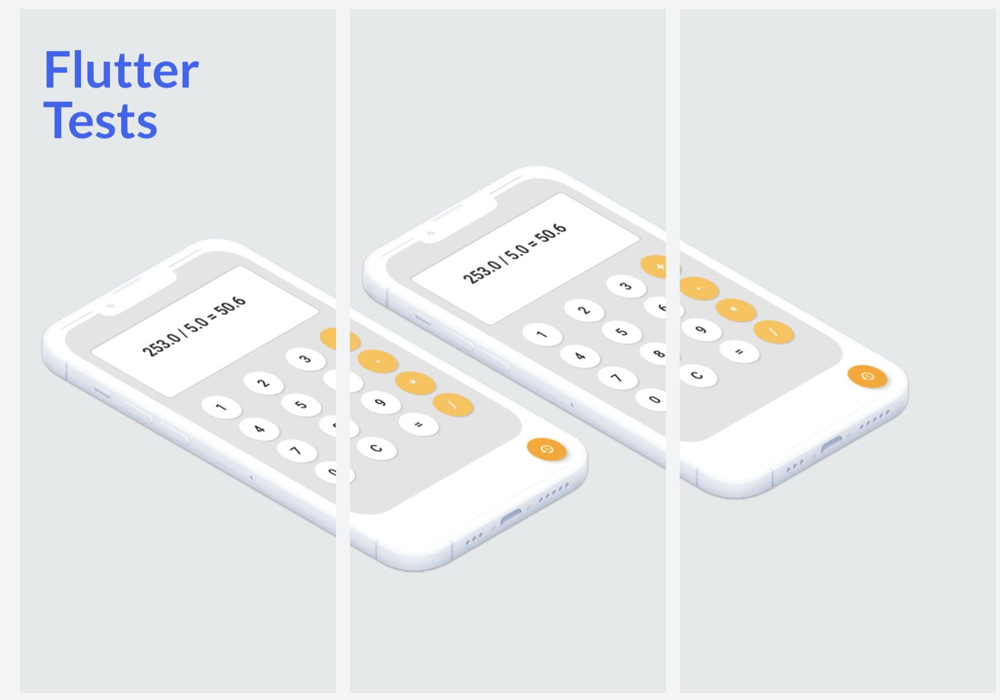

<!---->
<!---->
# Testing-App

## Description
Welcome to the Flutter testing project!

This project is a basic testing application built on top of the Flutter framework. It allows people to easily learn how to perform integration, widget and unit testing.

The project is open source, so anyone can contribute to it. It's a great way to learn more about Flutter testing and contribute to the community.

If you have any questions or suggestions, feel free to contact me.

Thanks for your interest in the Flutter testing project.

## IMPORTANT
Go to the MakeFile for know, how to run all test types

